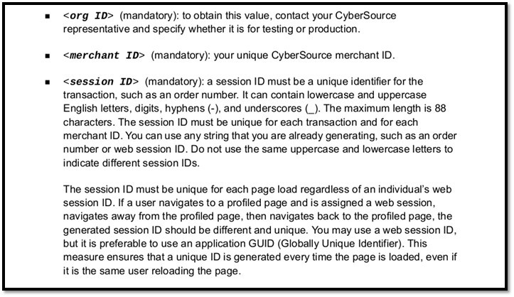

# Scripts
## Cálculo y envío del DF

> DESC.
```bash
<head>
    <script type="text/javascript" src="https://h.online-metrix.net/fp/tags.js?org_id=<org ID>&session_id=<merchant ID><session ID>"></script>
</head>
<body>
    <noscript>
        <iframe style="width: 100px; height: 100px; border: 0; position:absolute; top: -5000px;" src="https://h.online-metrix.net/fp/tags?org_id=<org ID>&session_id=<merchant ID><session ID>"></iframe>
    </noscript>
</body>
```



